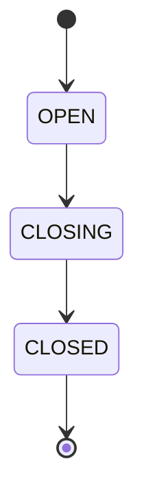
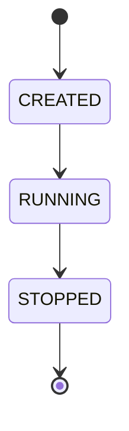
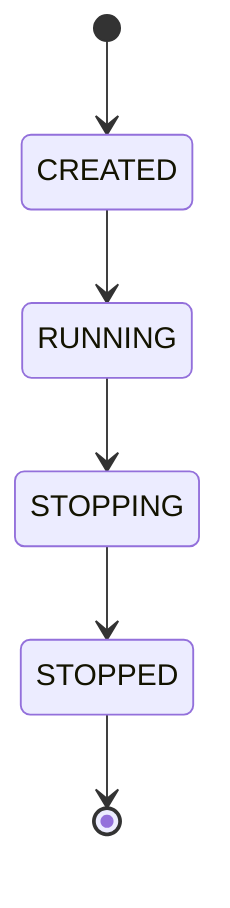

# jobq

## jobq::Q 
线程安全的任务队列。
### 生命周期

从构造开始，处于`OPEN`状态；调用`close`后，进入`CLOSING`状态；`CLOSING`状态中，不再接受push，pop到队列为空时，进入`CLOSED`状态。

### close 
`jobq::Q::close()` 用于关闭队列。
- Q: 是幂等的吗？A: 是的。多次调用，效果一致
- Q: 调用close时，是否会唤醒所有等待的线程？A: 会。`popOne` 和 `popOneFor` 都只
在队列为空时等待，`close`后，队列会永远不会再加入新元素了，因此不需要再等待。
- Q: 已经入队的任务，在`close`后，还能使用吗？A: 可以，在`close`后，如果队列中还有元素，`pop` 和 `popOneFor`都能继续获取。
- Q: 由于队列为空，正在等待的 `pop` 操作，在`close`时会怎么样？A: 会结束等待，返回std::nullopt。
- Q: 限时的 `popOnFor` 操作，在 `close`时会怎么样？A:会立刻结束等待，返回std::nullopt。
- Q: 生产者会和 `close`有竞争吗？A: `close` 的同时不能`push`，如果有多个`push`和`close`竞争，`close`开始前的能够成功，结束后的会失败。
- Q: 调用`close`时，`popOneFor`的返回和超时时有什么区别？A: 调用`close`时，
  `popOneFor`会停止等待，检查队列中是否有元素，有的话出队一个元素并返回，没有的
  话返回nullopt；超时时，会返回std::nullopt

### 操作效果
|状态|push|popOne|popOneFor|close|
|---|---|---|---|---|
|OPEN|成功入队，返回true|有元素时，出队；没有时等待|有元素时出队；没有时等待；超时后还没有返回nullopt|成功，进入CLOSING|
|CLOSING|失败，返回false|有元素时，出队；没有元素时，返回nullopt，进入CLOSED|有元素时出队；没有时返回nullopt，进入CLOSED|成功，状态不变|
|CLOSED|失败，返回false|返回nullopt|返回nullopt|没有影响|

### FIFO
- Q: MPMC 场景下的顺序保证？A: 全局顺序，global ordering。即，如果有多个生产者
同时向队列中push，多个消费者从队列中pop，出队的顺序和入队的顺序完全一致，但是，
由于多个线程执行，先出队的，不一定先执行完成。如果按照顺序push成功了a,b,c三个元
素，保证出队的顺序也是a,b,c

### 异常
不会抛出异常

## jobq::Worker
执行任务的“工作者”

### 生命周期

构造后，不会立刻开始执行。需要调用 `runUntilEmpty` 或者 `runForever` 开始，开始后，或者没有开始时，调用 `stop`，不再执行新任务

### stop
`jobq::Worker::stop()` 用来停止执行任务。
-Q: 是幂等的吗？A: 是的。多次调用效果一致。

### runUntilEmpty

### runForever
执行任务直到被停止。
调用`stop`后，可能有一个任务从队列中出队但是不会执行。

## jobq::Source
任务源，用于发布任务，比如定时任务、手动任务等。

## jobq::Executor
执行器，从任务源拉取任务，加入队列中，给执行者来做。

### 生命周期

调用 `run` 的线程作为“管家”线程，启动一组工作线程，和一个任务拉取线程。
调用`shutdown`，不再接受新任务，完成当前正在执行任务后，丢弃所有未完成任务；调用`shutdownAndDrain`后，不再接受新任务，完成已在队列中的所有任务。

