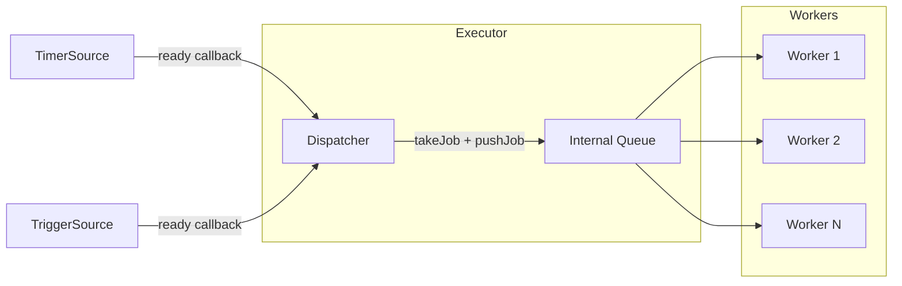
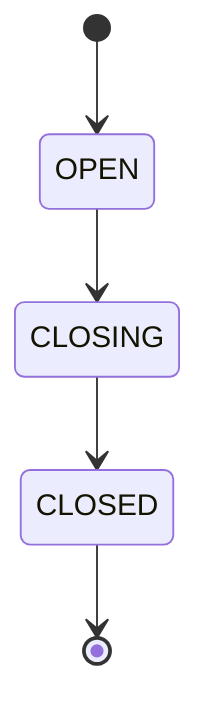
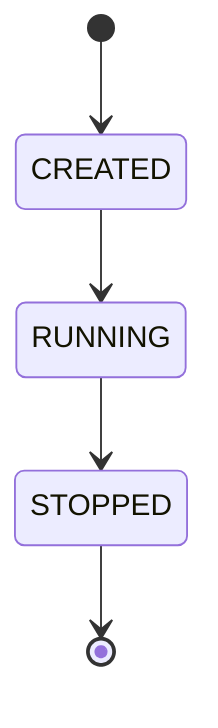
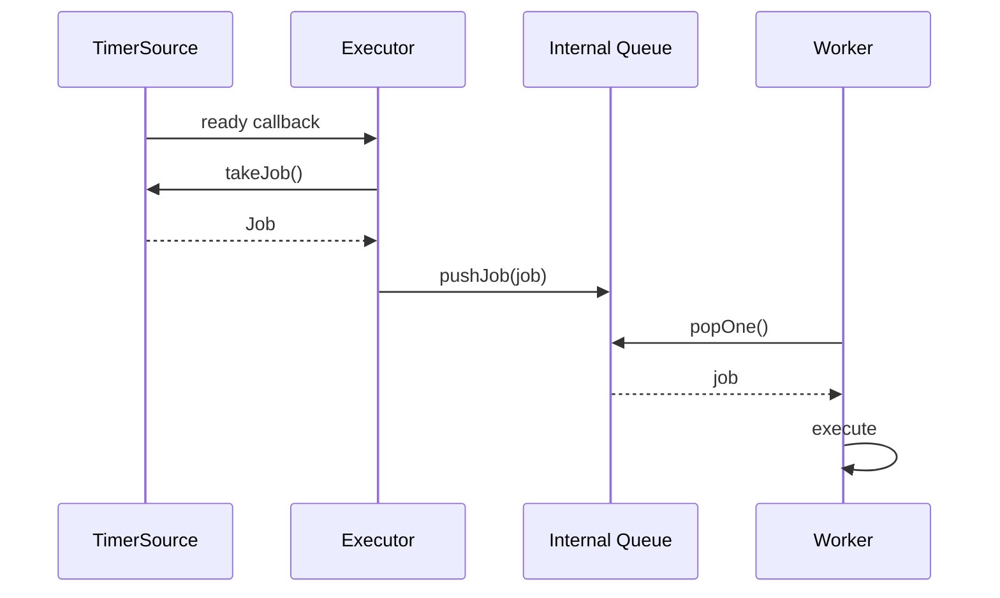

# jobq

[](https://github.com/yangda75/jobq/actions/workflows/ci.yml)

## 结构



职责分工：

- `Source` 不直接执行回调
- `Executor` 接收 source 的 ready 通知，并把 job 放入内部队列
- `Worker` 只关心从队列取任务并执行

这种划分让系统具备更清晰的扩展边界：

- 新增 source 类型时，不必改 worker
- 调整调度逻辑时，不必改具体 job 执行方式
- 关闭语义可以统一由 executor 定义

## 公开 API 概览

| 组件 | 作用 | 关键接口 |
|---|---|---|
| `jobq::Q` | 线程安全任务队列 | `pushJob`, `popOne`, `popOneFor`, `close` |
| `jobq::Worker` | 消费队列并执行任务 | `runUntilEmpty`, `runForever`, `stop` |
| `jobq::Executor` | 注册 source、接收任务并调度执行 | `registerSource`, `submitJob`, `run`, `shutdown`, `shutdownAndDrain` |
| `jobq::TimerSource` | 定时产生任务 | `Mode::ONE_SHOT`, `Mode::REPEATING` |
| `jobq::TriggerSource` | 外部显式触发任务 | `trigger` |
| `jobq::runExecutor` | 在后台线程启动 executor | `runExecutor(Executor&)` |

## 任务如何流动

一次典型执行路径如下：

1. `Source` 进入 ready 状态
2. `Source` 通过 ready callback 通知 `Executor`
3. `Executor` 的 dispatcher 取出 source，并调用 `takeJob()`
4. job 被推入内部 `Q`
5. `Worker` 从队列中取出 job 并执行


## jobq::Q 
线程安全的任务队列。
### 生命周期

从构造开始，处于`OPEN`状态；调用`close`后，进入`CLOSING`状态；`CLOSING`状态中，不再接受push，pop到队列为空时，进入`CLOSED`状态。

### close 
`jobq::Q::close()` 用于关闭队列。
- Q: 是幂等的吗？A: 是的。多次调用，效果一致
- Q: 调用close时，是否会唤醒所有等待的线程？A: 会。`popOne` 和 `popOneFor` 都只
在队列为空时等待，`close`后，队列会永远不会再加入新元素了，因此不需要再等待。
- Q: 已经入队的任务，在`close`后，还能使用吗？A: 可以，在`close`后，如果队列中还有元素，`pop` 和 `popOneFor`都能继续获取。
- Q: 由于队列为空，正在等待的 `pop` 操作，在`close`时会怎么样？A: 会结束等待，返回std::nullopt。
- Q: 限时的 `popOnFor` 操作，在 `close`时会怎么样？A:会立刻结束等待，返回std::nullopt。
- Q: 生产者会和 `close`有竞争吗？A: `close` 的同时不能`push`，如果有多个`push`和`close`竞争，`close`开始前的能够成功，结束后的会失败。
- Q: 调用`close`时，`popOneFor`的返回和超时时有什么区别？A: 调用`close`时，
  `popOneFor`会停止等待，检查队列中是否有元素，有的话出队一个元素并返回，没有的
  话返回nullopt；超时时，会返回std::nullopt

### 操作效果
|状态|push|popOne|popOneFor|close|
|---|---|---|---|---|
|OPEN|成功入队，返回true|有元素时，出队；没有时等待|有元素时出队；没有时等待；超时后还没有返回nullopt|成功，进入CLOSING|
|CLOSING|失败，返回false|有元素时，出队；没有元素时，返回nullopt，进入CLOSED|有元素时出队；没有时返回nullopt，进入CLOSED|成功，状态不变|
|CLOSED|失败，返回false|返回nullopt|返回nullopt|没有影响|

### FIFO
- Q: MPMC 场景下的顺序保证？A: 全局顺序，global ordering。即，如果有多个生产者
同时向队列中push，多个消费者从队列中pop，出队的顺序和入队的顺序完全一致，但是，
由于多个线程执行，先出队的，不一定先执行完成。如果按照顺序push成功了a,b,c三个元
素，保证出队的顺序也是a,b,c

### 异常
不会抛出异常

## jobq::Worker
`Worker` 负责从 `Q` 中取任务并执行。

公开行为：

- `runUntilEmpty()`：持续执行，直到队列为空且无法继续取到任务
- `runForever()`：持续执行，直到被停止或队列关闭
- `stop()`：请求停止，不再继续处理新任务

`Worker` 不感知 source，也不负责调度，只负责消费队列。

### 生命周期

构造后，不会立刻开始执行。需要调用 `runUntilEmpty` 或者 `runForever` 开始，开始后，或者没有开始时，调用 `stop`，不再执行新任务

### stop
`jobq::Worker::stop()` 用来停止执行任务。
-Q: 是幂等的吗？A: 是的。多次调用效果一致。

### runUntilEmpty

### runForever
执行任务直到被停止。
调用`stop`后，可能有一个任务从队列中出队但是不会执行。

## jobq::Source
任务源，用于发布任务，比如定时任务、手动任务等。

### TimerSource

`TimerSource` 用于周期性或一次性地产生任务。

支持两种模式：

- `Mode::ONE_SHOT`
- `Mode::REPEATING`

行为：

- `ONE_SHOT`：到期后触发一次，随后结束
- `REPEATING`：按固定间隔重复触发，直到 `stop()` 或 executor 关闭

一次 timer callback 的流转可以概括为：




## jobq::Executor
`Executor` 是系统的调度核心。

它负责：

- 持有注册进来的 source
- 接收 source 的 ready 通知
- 从 source 中取出 job
- 把 job 推入内部队列
- 启动和管理 worker 线程
- 定义关闭语义

构造函数支持 worker 数量配置：

```cpp
jobq::Executor ex{1};
jobq::Executor ex2{4};
```

### 直接提交任务

除了 source 驱动，当前 executor 也保留了直接注入任务的路径：

```cpp
ex.submitJob([]() {
    // do work
});
```

这适合测试、过渡性使用，或者把 executor 当成一个带关闭语义的执行容器。

### `run()`

`run()` 会启动整个执行系统，并阻塞当前线程直到 executor 结束。

运行期间会存在三类活动实体：

- 调用 `run()` 的线程：等待整个系统结束
- dispatcher 线程：等待 ready source，并将其转换为 job
- worker 线程：从内部队列中取任务并执行

如果希望在后台运行，可以使用：

```cpp
auto th = jobq::runExecutor(ex);
```

## 关闭语义

`Executor` 明确区分两种关闭方式。

### `shutdown()`

语义目标：

- 不再接受新任务
- 停止 source 继续产生新任务
- 正在执行中的任务允许结束
- 已经入队但尚未开始执行的任务会被丢弃

适用场景：

- 需要尽快停机
- backlog 不要求全部处理完成

### `shutdownAndDrain()`

语义目标：

- 不再接受新任务
- 停止 source 继续产生新任务
- 已经进入内部队列的任务会继续执行直到队列清空

适用场景：

- 需要有序关闭
- 不希望丢掉已经 ready 的任务

### 对比

| 行为 | `shutdown()` | `shutdownAndDrain()` |
|---|---|---|
| 接受新任务 | 否 | 否 |
| 停止 source | 是 | 是 |
| 正在执行中的任务 | 完成 | 完成 |
| 已入队但未开始执行的任务 | 丢弃 | 继续执行 |
| 目标 | 尽快停止 | 有序排空 |

## 最小示例

### 1. 定时任务

```cpp
#include "Executor.h"
#include "TimerSource.h"
#include "Utils.h"

#include <atomic>
#include <chrono>
#include <memory>
#include <thread>

int main() {
    jobq::Executor ex{2};
    std::atomic_int tick_count{0};

    auto timer = std::make_shared<jobq::TimerSource>(
        jobq::TimerSource::Mode::REPEATING,
        100,
        [&tick_count]() { ++tick_count; });

    ex.registerSource(timer);

    auto runner = jobq::runExecutor(ex);
    std::this_thread::sleep_for(std::chrono::seconds(1));
    ex.shutdownAndDrain();
    runner.join();
}
```

### 2. 手动触发任务

```cpp
#include "Executor.h"
#include "TriggerSource.h"
#include "Utils.h"

#include <atomic>
#include <memory>

int main() {
    jobq::Executor ex{};
    std::atomic_bool fired{false};

    auto src = std::make_shared<jobq::TriggerSource>(
        "demo-trigger",
        [&fired]() { fired = true; });

    ex.registerSource(src);
    auto runner = jobq::runExecutor(ex);

    src->trigger();

    ex.shutdownAndDrain();
    runner.join();
}
```

## 测试覆盖

当前测试已覆盖的行为包括：

- 队列基本 push / pop
- `close()` 对阻塞消费者的唤醒
- close 后 drain 行为
- 多 worker 并发消费
- executor 的启动与等待
- `shutdown()` 与 `shutdownAndDrain()` 的语义差异
- one-shot timer 只触发一次
- repeating timer 重复触发
- 多个 timer 并发工作
- 多 worker 下 timer 回调执行
- `TriggerSource` 注册与触发

