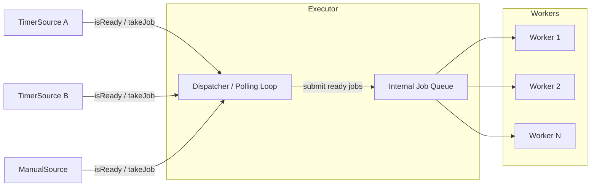
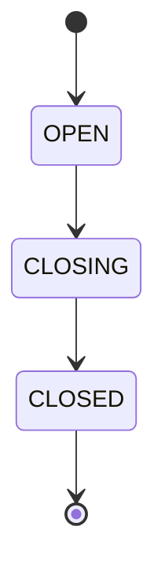
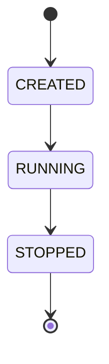
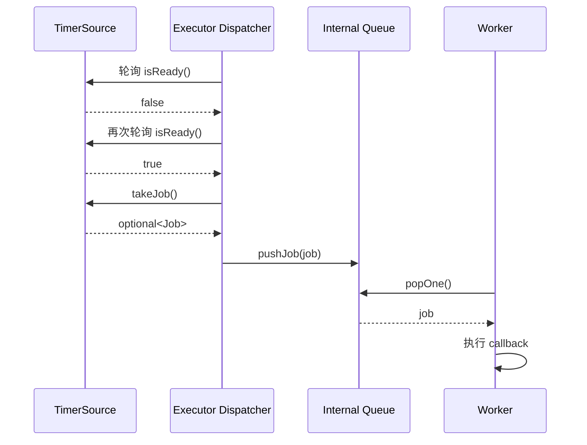
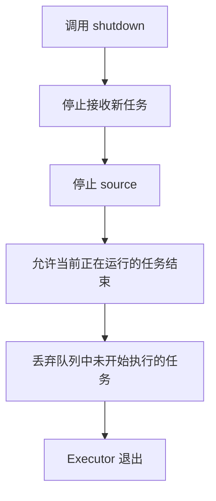
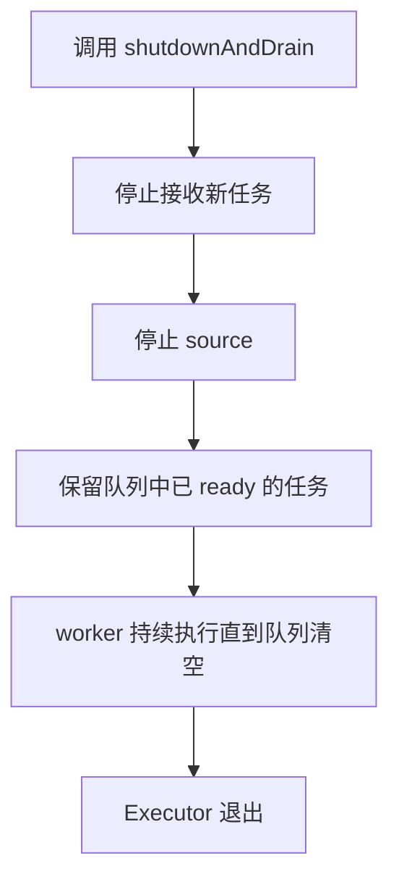

# jobq


## 架构图



- source 不直接执行回调
- worker 不直接感知 source
- executor 是中间层，负责“观察 source + 调度 ready job + 管理生命周期”


## jobq::Q 
线程安全的任务队列。
### 生命周期

从构造开始，处于`OPEN`状态；调用`close`后，进入`CLOSING`状态；`CLOSING`状态中，不再接受push，pop到队列为空时，进入`CLOSED`状态。

### close 
`jobq::Q::close()` 用于关闭队列。
- Q: 是幂等的吗？A: 是的。多次调用，效果一致
- Q: 调用close时，是否会唤醒所有等待的线程？A: 会。`popOne` 和 `popOneFor` 都只
在队列为空时等待，`close`后，队列会永远不会再加入新元素了，因此不需要再等待。
- Q: 已经入队的任务，在`close`后，还能使用吗？A: 可以，在`close`后，如果队列中还有元素，`pop` 和 `popOneFor`都能继续获取。
- Q: 由于队列为空，正在等待的 `pop` 操作，在`close`时会怎么样？A: 会结束等待，返回std::nullopt。
- Q: 限时的 `popOnFor` 操作，在 `close`时会怎么样？A:会立刻结束等待，返回std::nullopt。
- Q: 生产者会和 `close`有竞争吗？A: `close` 的同时不能`push`，如果有多个`push`和`close`竞争，`close`开始前的能够成功，结束后的会失败。
- Q: 调用`close`时，`popOneFor`的返回和超时时有什么区别？A: 调用`close`时，
  `popOneFor`会停止等待，检查队列中是否有元素，有的话出队一个元素并返回，没有的
  话返回nullopt；超时时，会返回std::nullopt

### 操作效果
|状态|push|popOne|popOneFor|close|
|---|---|---|---|---|
|OPEN|成功入队，返回true|有元素时，出队；没有时等待|有元素时出队；没有时等待；超时后还没有返回nullopt|成功，进入CLOSING|
|CLOSING|失败，返回false|有元素时，出队；没有元素时，返回nullopt，进入CLOSED|有元素时出队；没有时返回nullopt，进入CLOSED|成功，状态不变|
|CLOSED|失败，返回false|返回nullopt|返回nullopt|没有影响|

### FIFO
- Q: MPMC 场景下的顺序保证？A: 全局顺序，global ordering。即，如果有多个生产者
同时向队列中push，多个消费者从队列中pop，出队的顺序和入队的顺序完全一致，但是，
由于多个线程执行，先出队的，不一定先执行完成。如果按照顺序push成功了a,b,c三个元
素，保证出队的顺序也是a,b,c

### 异常
不会抛出异常

## jobq::Worker
执行任务的“工作者”

### 生命周期

构造后，不会立刻开始执行。需要调用 `runUntilEmpty` 或者 `runForever` 开始，开始后，或者没有开始时，调用 `stop`，不再执行新任务

### stop
`jobq::Worker::stop()` 用来停止执行任务。
-Q: 是幂等的吗？A: 是的。多次调用效果一致。

### runUntilEmpty

### runForever
执行任务直到被停止。
调用`stop`后，可能有一个任务从队列中出队但是不会执行。

## jobq::Source
任务源，用于发布任务，比如定时任务、手动任务等。

### Timer 回调生命周期

以 `TimerSource` 为例，一次回调从“未到期”到“执行完成”的过程如下：



对 `TimerSource` 来说，细节差异如下：
#### one-shot timer

1. 创建时记录起始时间
2. 在到期前，`isReady()` 返回 `false`
3. 到期后，`isReady()` 返回 `true`
4. executor 调用 `takeJob()`
5. source 返回一个 job，并把自己标记为 finished
6. 后续 executor 不再需要调度这个 source

#### repeating timer

1. 创建时记录起始时间
2. 到期后，executor 调用 `takeJob()`
3. source 返回一个 job
4. source 把下一轮计时起点重置为“当前时刻”
5. executor 继续在后续轮询里观察它
6. 直到 `stop()` 或系统关闭为止


## jobq::Executor
执行器，从任务源拉取任务，加入队列中，给执行者来做。

- 持有注册进来的 sources
- 轮询每个 source 是否 ready
- 把 ready callback 转成内部 job，推入队列
- 管理 worker 线程
- 定义 shutdown / drain 的确语义

构造时可以配置 worker 数量，默认是 `1`。

调用 `run` 的线程作为“管家”线程，启动一组工作线程，和一个任务拉取线程。
调用`shutdown`，不再接受新任务，完成当前正在执行任务后，丢弃所有未完成任务；调用`shutdownAndDrain`后，不再接受新任务，完成已在队列中的所有任务。

### run
`Executor::run()` 的角色不是“执行一个函数”，而是启动整个执行系统。

运行后会存在三类活动实体：

- 调用 `run()` 的线程：负责启动与等待整个执行系统结束
- dispatcher 线程：轮询 sources，把 ready job 推入内部队列
- worker 线程：从内部队列取任务并执行

从职责分工上看：

- dispatcher 决定“什么可以执行”
- queue 负责“怎样安全交接任务”
- workers 决定“谁来实际执行”

这让系统具备比较清晰的扩展方向：

- 未来可以增加新的 source 类型，而不必改 worker
- 未来可以替换 polling 机制，而不必改任务执行语义
- 未来可以增加 pub/sub、fd event、subscription callback，而不必重写整个 executor


### `shutdown()`

语义目标：

- 不再接受新任务
- 停止 sources 继续产出新回调
- 正在执行的回调允许跑完
- 已经在队列里、但尚未开始执行的任务会被丢弃

适用场景：

- 需要尽快停机
- 不要求把 backlog 全部跑完
- 更关注快速收敛而不是完整处理剩余任务

示意：



### `shutdownAndDrain()`

语义目标：

- 不再接受新任务
- 停止 sources 继续产出新回调
- 已经进入内部队列的任务继续执行直到清空
- 然后 worker 退出，executor 结束

适用场景：

- 需要“有序关闭”
- 已经 ready 的回调不希望丢失
- 更关注处理完整性而不是最短停机时间

示意：



### 二者区别总结

|行为|`shutdown()`|`shutdownAndDrain()`|
|---|---|---|
|接受新任务|否|否|
|停止 source|是|是|
|正在执行中的任务|完成|完成|
|已入队但未开始执行的任务|丢弃|继续执行|
|目标|尽快停止|有序排空|

这也是中间件执行器里非常重要的一点：停止不是单一动作，而是一套明确的生命周期语义。


## 一个最小示例

```cpp
#include "Executor.h"
#include "TimerSource.h"
#include <atomic>
#include <memory>

int main() {
    using namespace jobq;

    Executor ex{2};
    std::atomic_int tick_count{0};

    auto timer = std::make_shared<TimerSource>(
        TimerSource::Mode::REPEATING,
        100,
        [&tick_count]() {
            ++tick_count;
        });

    ex.registerSource(timer);
    ex.run();
}
```

在真实使用中，通常会由另一个线程在合适时机调用：

- `shutdown()`，快速停机
- `shutdownAndDrain()`，有序排空后停机

